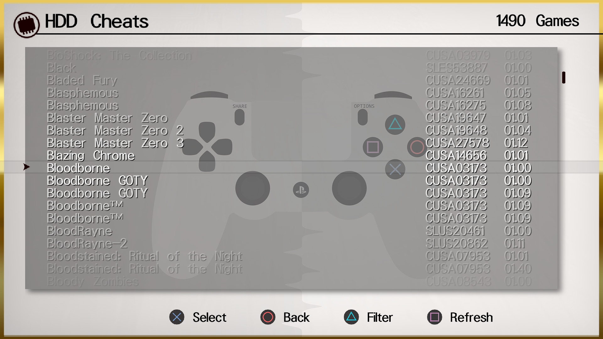
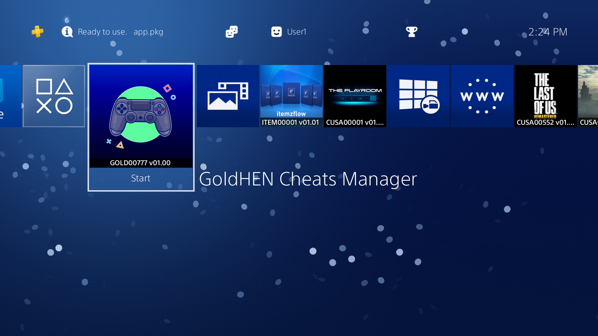

# GoldHEN Cheats Manager

[![Downloads][img_downloads]][app_downloads] [![Release][img_latest]][app_latest] [![License][img_license]][app_license]
[](https://github.com/GoldHEN/GoldHEN_Cheat_Manager/actions/workflows/build.yml)

An open-source PlayStation 4 cheat code manager for GoldHEN.






**GoldHEN Cheats Manager** is a simple PS4 homebrew application that manages GoldHEN cheat codes files.

# Download

Get the [latest version here][app_latest].

## Changelog

See the [latest changes here](CHANGELOG.md).

# Donations

My GitHub projects are open to a [Patreon sponsor program](https://patreon.com/dparrino). If you feel that my tools helped you in some way or you would like to support future developments, you can consider a [PayPal donation](https://www.paypal.me/bucanerodev).

# Setup instructions

No special setup is needed. Just download the latest `IV0000-GOLD00777_00-GOLDCHEATS000PS4.pkg` package and install it on your PlayStation 4.
On first run, the application will detect and setup the required user settings.

# Usage

Using the application is simple and straight-forward: 

 - Move <kbd>UP</kbd>/<kbd>DOWN</kbd> to select the cheat file you want to view, and press . The cheat list screen will show the available codes for the game.
 - To view the item's details, press .
It will open the context menu on the screen. Press  to return to the list.
 - To reload the list, press .
 - Press <kbd>L1</kbd>/<kbd>L2</kbd> or <kbd>R1</kbd>/<kbd>R2</kbd> trigger buttons to move pages up or down.

# Online Database

The application also provides direct access to the Online [Cheat](https://github.com/GoldHEN/GoldHEN_Cheat_Repository) and [Patch](https://github.com/GoldHEN/GoldHEN_Patch_Repository) databases, the official GoldHEN repositories of cheats and custom game patches for PlayStation 4 games.

# Credits

* [Bucanero](https://github.com/bucanero): Project developer
* [Ctn123](https://github.com/ctn123): Cheat Engine
* [Shiningami](https://github.com/ScriptSK): Cheat Engine
* [SiSTRo](https://github.com/SiSTR0): [GoldHEN](https://github.com/GoldHEN/GoldHEN)
* [Kameleon](https://github.com/kmeps4): QA Support

### Artemis PS3 credits

* [Dnawrkshp](https://github.com/Dnawrkshp/): [Artemis PS3](https://github.com/Dnawrkshp/ArtemisPS3)
* [Berion](https://www.psx-place.com/members/berion.1431/): GUI design

# Building

You need to have installed:

- [Open Orbis SDK](https://github.com/OpenOrbis/OpenOrbis-PS4-Toolchain/)
- [cJSON](https://github.com/bucanero/cJSON) library
- [Zip](https://github.com/bucanero/zip) library
- [SDL2](https://github.com/PacBrew/SDL/tree/ps4) library
- [libJbc](https://github.com/bucanero/ps4-libjbc) library
- [Mini-XML](https://github.com/bucanero/mxml) library
- [PolarSSL](https://github.com/bucanero/oosdk_libraries/tree/master/polarssl-1.3.9) library
- [libcurl](https://github.com/bucanero/oosdk_libraries/tree/master/curl-7.64.1) library
- [dbglogger](https://github.com/bucanero/dbglogger) library (required for debug logging)

Run `make` to create a release build. If you want to include the latest save patches in your `.pkg` file, run `make createzip`.

You can also set the `PS3LOAD` environment variable to your PS4 IP address: `export PS3LOAD=tcp:x.x.x.x`.
This will allow you to use `make run` and send `eboot.bin` directly to the [PS4Load listener](https://github.com/bucanero/ps4load).

To enable debug logging, build it with `make DEBUGLOG=1`. The application will send debug messages to
UDP multicast address `239.255.0.100:30000`. To receive them you can use [socat][] on your computer:

```
$ socat udp4-recv:30000,ip-add-membership=239.255.0.100:0.0.0.0 -
```

# License

[GoldHEN Cheats Manager](https://github.com/GoldHEN/GoldHEN_Cheat_Manager/) - Copyright (C) 2022  [Damian Parrino](https://twitter.com/dparrino)

This program is free software: you can redistribute it and/or modify
it under the terms of the [GNU General Public License][app_license] as published by
the Free Software Foundation, either version 3 of the License, or
(at your option) any later version.

[app_license]: https://github.com/GoldHEN/GoldHEN_Cheat_Manager/blob/main/LICENSE
[app_downloads]: https://github.com/GoldHEN/GoldHEN_Cheat_Manager/releases
[app_latest]: https://github.com/GoldHEN/GoldHEN_Cheat_Manager/releases/latest
[img_license]: https://img.shields.io/github/license/GoldHEN/GoldHEN_Cheat_Manager.svg?maxAge=2592000
[img_downloads]: https://img.shields.io/github/downloads/GoldHEN/GoldHEN_Cheat_Manager/total.svg?maxAge=3600
[img_latest]: https://img.shields.io/github/release/GoldHEN/GoldHEN_Cheat_Manager.svg?maxAge=3600
[socat]: http://www.dest-unreach.org/socat/
